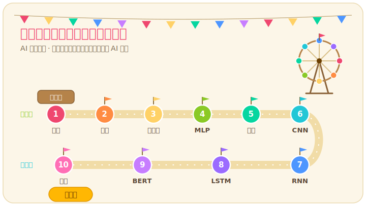

# 東吳大學資料科學系 × 明倫高中 — 2026 暑期 AI 技術實作營隊



歡迎明倫高中的同學們來到由**東吳大學資料科學系**與**自然語言處理實驗室 (NLP Lab)** 聯合舉辦的 2026 暑期 AI 技術實作營隊！

這個專案收錄了兩天課程所需的全部**網頁版互動式簡報**與 **Colab 雲端實作教材**。在這兩天的旅程中，你將親自用 Python 程式碼與 PyTorch 框架，訓練出你人生中第一個深度學習模型，從基礎影像辨識一路挑戰到最前沿的生成式 AI（字元接龍與 BERT 語言模型）！

---

## 課程線上簡報

本營隊簡報採用高互動式設計，你可以直接點選下方連結，用手機、平板或電腦隨時瀏覽簡報：

 **<a href="https://jlwustudio.github.io/ai_workshop_minglun_2026/" target="_blank">點我開啟：暑期 AI 探險樂園線上簡報</a>**

*(簡報專為行動裝置進行了 RWD 排版設計，如果畫面上的控制選單擋住字，你可以用手指自由拖曳移動選單位置！)*

---

## 實作教材一鍵啟動 (Google Colab)

我們將使用 Google 提供的免費雲端運算平台（Google Colab）進行所有 AI 模型訓練，你不需要在電腦上安裝任何複雜的程式。

請點選下表中的 **Open in Colab** 徽章，即可將該單元的實作檔案一鍵匯入雲端環境開始動手做：

| 課程單元 | 實作任務與核心技術 | 雲端一鍵啟動 |
| :--- | :--- | :---: |
| **Day 1-1：GPU 效能驗證** | 熟悉 Colab 介面，並測試 CPU 與 顯示卡 (GPU) 的運算速度對決。 | [](https://colab.research.google.com/github/jlwustudio/ai_workshop_minglun_2026/blob/main/notebooks/01_gpu_check.ipynb) |
| **Day 1-2：房價迴歸預測** | 以加州房價真實數據，訓練一個線性模型，學習神經網路如何「預測數值」。 | [](https://colab.research.google.com/github/jlwustudio/ai_workshop_minglun_2026/blob/main/notebooks/02_housing_regression.ipynb) |
| **Day 1-3：鳶尾花感知器二分類** | 實作最經典的感知器與活化函數，對鳶尾花品種進行自動分類。 | [](https://colab.research.google.com/github/jlwustudio/ai_workshop_minglun_2026/blob/main/notebooks/03_single_neuron.ipynb) |
| **Day 1-4：MLP 手寫數字辨識** | 載入著名的 MNIST 資料集，將二維影像扁平化並堆疊多層神經元分類手寫數字。 | [](https://colab.research.google.com/github/jlwustudio/ai_workshop_minglun_2026/blob/main/notebooks/04_mlp_mnist.ipynb) |
| **Day 1-5：貓咪影像特徵提取** | 手動設定不同的卷積核 (Convolution Kernel)，體驗電腦視覺如何「看見」邊緣與特徵。 | [](https://colab.research.google.com/github/jlwustudio/ai_workshop_minglun_2026/blob/main/notebooks/05_cnn_visual.ipynb) |
| **Day 1-6：CNN 彩色物體分類** | 訓練經典的卷積神經網路 (CNN)，讓電腦學會分辨飛機、貓狗等 10 種彩色影像。 | [](https://colab.research.google.com/github/jlwustudio/ai_workshop_minglun_2026/blob/main/notebooks/06_cnn_cifar10.ipynb) |
| **Day 2-1：RNN 英文姓名生成** | 載入真實美國姓名資料，訓練 RNN 進行「字元接龍」，讓 AI 自動幫你取英文名字。 | [](https://colab.research.google.com/github/jlwustudio/ai_workshop_minglun_2026/blob/main/notebooks/07_rnn_text_gen.ipynb) |
| **Day 2-2：IMDb 電影影評情感分析** | 學習詞嵌入 (Word Embedding) 語意空間，使用 LSTM 神經網路分類影評的正面/負面情緒。 | [](https://colab.research.google.com/github/jlwustudio/ai_workshop_minglun_2026/blob/main/notebooks/08_lstm_sentiment.ipynb) |
| **Day 2-3：BERT 中文輿情與克漏字** | 學習當代大模型的核心「自注意力機制」，使用中文 BERT 模型進行社群文情感分析。 | [](https://colab.research.google.com/github/jlwustudio/ai_workshop_minglun_2026/blob/main/notebooks/09_bert_nlp.ipynb) |
| **結業挑戰：BERT 情緒偵測與接話器** | 綜合挑戰！將預訓練大模型組裝成你自己的「情緒偵測與自動接話小幫手」並分享成果！ | [](https://colab.research.google.com/github/jlwustudio/ai_workshop_minglun_2026/blob/main/notebooks/10_capstone.ipynb) |

---

## 課堂互動視覺化沙盒 (AI Playgrounds)

除了程式實作，我們也精選了多個全球頂尖的**免安裝網頁版互動式沙盒**，點擊即可直接在瀏覽器中動手玩轉 AI 機制：

* **Session 1 & 3 [Google TensorFlow Playground](https://playground.tensorflow.org)**：自由增加隱藏層、神經元與調整活化函數，親眼觀察神經網路如何扭曲空間來分類資料。
* **Session 2 [Least-Squares Regression 互動擬合](https://phet.colorado.edu/sims/html/least-squares-regression/latest/least-squares-regression_all.html?locale=zh_TW)**：在畫布上點選資料點，直觀感受「誤差平方和」如何隨迴歸線動態收縮。
* **Session 4 [MNIST 3D Neural Network Visualizer](https://adamharley.com/nn_vis/mlp/3d.html)**：手寫一個數字，立體觀察每一層神經元是如何亮起、傳遞並得出分類結果。
* **Session 5 [Setosa Image Kernels 卷積視覺化](https://setosa.io/ev/image-kernels/)**：即時修改卷積核數值，直觀感受滑動矩陣乘法如何提煉出影像的輪廓與特徵。
* **Session 6 [CNN Explainer](https://poloclub.github.io/cnn-explainer/)**：全面拆解 CNN 影像分類模型，點選即可檢視卷積、ReLU、最大池化 (Max Pooling) 到 Softmax 的完整 3D 計算流。
* **Session 7 & 8 [Hugging Face Write With Transformer](https://transformer.huggingface.co/)**：與大語言模型進行寫作接龍，調整 Temperature 參數來引導模型產生不同隨機性的回答。
* **Session 8 [Google TensorFlow Embedding Projector](https://projector.tensorflow.org/)**：將數萬個詞彙投影在三維語意空間中，搜尋並觀察相似語意的單字如何群聚在一起。
* **Session 9 [LLM 3D Architecture 結構圖解](https://bbycroft.net/llm)**：史上最精細的 3D Transformer 結構圖，滑動即可檢視自注意力機制與前饋網路的矩陣流向。

---

## 實作環境說明

本營隊提供三種執行實作教材的方案。建議優先選擇「方案一：雲端模式」，無須在電腦上進行任何設定。

### 方案一：雲端模式 (推薦)

適合所有學員。只要電腦能連線上網，即可利用 Google Colab 的免費雲端 GPU 進行訓練：

1. 點選上方表格中的 **Open in Colab** 徽章進入實作頁面。
2. 點選網頁右上角的連線下拉選單，選擇「變更執行階段類型」。
3. 將硬體加速器切換為 **T4 GPU**，然後點選「儲存」。
4. 依序執行程式的儲存格，即可在雲端進行深度學習模型訓練。

---

### 方案二：本地與電腦教室模式 (進階使用者參考)

<details>
<summary>點選展開：如何在電腦教室將 Colab 前端橋接至本地顯示卡進行運作</summary>

若需在電腦教室使用本地高效能顯示卡進行高速運算，請遵循以下步驟：

1. **複製本儲存庫**：
   ```bash
   git clone https://github.com/jlwustudio/ai_workshop_minglun_2026.git
   cd ai_workshop_minglun_2026
   ```
2. **建立並啟用 Python 虛擬環境**：
   ```bash
   # 建立名為 .venv 的虛擬環境
   python3 -m venv .venv

   # 啟用虛擬環境 (Mac / Linux)
   source .venv/bin/activate

   # 啟用虛擬環境 (Windows)
   # Windows Command Prompt: .venv\Scripts\activate.bat
   # Windows PowerShell: .venv\Scripts\Activate.ps1
   ```
3. **安裝相依套件**：
   ```bash
   pip install --upgrade pip
   pip install -r requirements.txt
   ```
4. **啟動本地 Jupyter 服務並允許跨網域連線**：
   執行以下指令在本地背景開啟 Jupyter 伺服器，以便作為 Colab 的後端運作（我們加上了 `--no-browser` 參數，防止本機自動彈出本地的 Jupyter 網頁介面）：
   ```bash
   jupyter notebook --NotebookApp.allow_origin='https://colab.research.google.com' --port=8888 --NotebookApp.port_retries=0 --no-browser
   ```
   執行後，終端機會輸出帶有 `token` 的伺服器連結（例如 `http://localhost:8888/?token=...`），請將其複製起來。

5. **在 Colab 網頁中橋接本地顯示卡**：
   - 請先點選上方表格的 **Open in Colab** 徽章，打開該單元的 Google Colab 線上頁面。
   - 在 Colab 網頁右上角連線下拉選單中，點選「連線至本地執行階段」。
   - 在彈出的輸入框中貼上剛剛複製的帶有 `token` 的連結，點選「連線」即可。此時，您雖然在使用 Colab 網頁介面操作，但背後實際是在調用您本地電腦的 GPU 進行運作！
</details>

---

### 方案三：本地獨立開發模式 (直接使用本地 Jupyter 介面)

<details>
<summary>點選展開：如何在本地電腦直接啟動 Jupyter 介面進行實作</summary>

適合想要完全在本地電腦進行開發、不依賴 Google 帳號與 Google Colab 服務的同學：

1. **複製本儲存庫與啟用虛擬環境**：
   請先完成「方案二」中的步驟 1 與步驟 2（複製專案並啟用 `.venv` 虛擬環境）。
2. **安裝相依套件**：
   請先完成「方案二」中的步驟 3（安裝並升級 `requirements.txt` 所需套件）。
3. **啟動 Jupyter Notebook 服務**：
   在啟用虛擬環境後的終端機中，執行以下指令：
   ```bash
   jupyter notebook
   ```
4. **開啟與開發**：
   - 執行後，瀏覽器會自動彈出並開啟 `http://localhost:8888` 的 Jupyter 網頁管理介面。
   - 在左側的檔案樹中進入 `notebooks/` 資料夾，即可直接打開並執行各單元 `.ipynb` 教材！
</details>

---

## 主辦單位簡介

### [東吳大學資料科學系 (巨量資料管理學院)](https://bigdata.scu.edu.tw)
我們是全台第一所專門培育資料科學與 AI 應用人才的專業科系。我們致力於利用資料、演算法與前沿 AI 技術，解決商業預測、智慧醫療、科技金融與機器視覺等真實世界的挑戰。只要你熱愛資料、渴望成為 AI 的「創造者」而非單純的「使用者」，東吳大學資料科學系就是你的最佳舞台！

### [自然語言處理實驗室 (NLP Lab)](https://nlp.bigdata.scu.edu.tw)
由本課程主講人**吳政隆教授**主持，專注於自然語言處理 (NLP)、大語言模型 (LLM)、文字探勘以及輿情分析等前沿研究。我們非常歡迎未來考入東吳資科系的同學們加入，一同探索語言 AI 的奧秘！